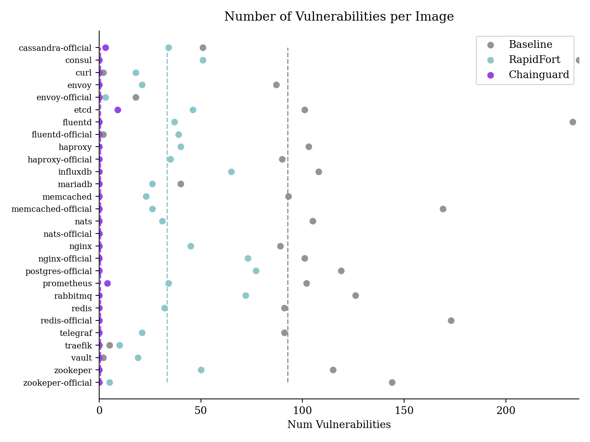

# images-research




### Description

This repository hosts the scripts used to generate data for a technical analysis comparing container image hardening techniques.

The data used in the study can be found at `data/19-Oct-2023/`. The easiest way to produce your own data is to install dependencies and execute the run script.

To install dependencies and setup a virtual environment to run the script, run these command:
```
sudo ./install_deps.sh
python -m venv env
source env/bin/activate
pip install -r requirements.txt
```

Now execute the run script:
```
./run_all.sh
```
The run script creates a new directory under `data/` named after the date, where all generated scans, data sets, and analysis are saved. The directory will look like this after executing the run script:

```
data
└── [day]-[month]-[year]
    ├── analysis
    │   ├── figures
    │   │   ├── comps_fig.png
    │   │   ├── sizes_fig.png
    │   │   ├── vulns_fig.png
    │   │   ├── vulns_p_comp_fig.png
    │   │   ├── vulns_p_comp_severe_fig.png
    │   │   └── vulns_severe_fig.png
    │   └── summary.txt
    ├── data-sets
    │   ├── agg.csv
    │   ├── comps.csv
    │   ├── sizes.csv
    │   └── vulns.csv
    └── reports
        ├── grype
        │   ├── [image vendor]_[image type].json
        │   ├── ...
        │
        └── syft
            ├── [image vendor]_[image type].json
            |   ├── ...
```     

### Data Generation Stages
Data is generated in three stages

**Stage 1: Image Scanning**. Images listed in images.json are pulled and scanned with Grype and Syft. Scan reports are saved to the `reports/` subdirectory.

See `scripts/1_scan_images.py`.

**Stage 2: Data set generation**. Scan reports are parsed and aggregated into four CSV files saved under the `data-sets/` subdirectory:
- `vulns.csv` - Vulnerabilities detected across all images
- `sizes.csv` - Size in bytes of all images
- `comps.csv` - Components detected across all images
- `agg.csv`   - Aggregated size, vulnerability, and component data

See `2_build_datasets.py`.

**Stage 3: Analysis**. Generate figures and summary statistics from the `agg.csv` data set. The summary is saved to `analysis/summary.txt`. Figures are saved under `analysis/figures`.

Performed by `scripts/3_analyze.py`.